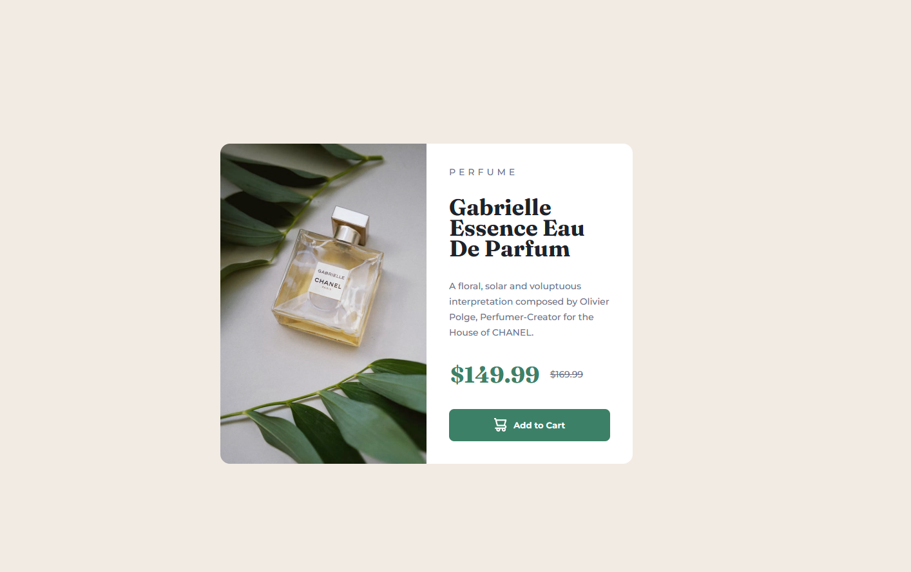

# 😶‍🌫️ Frontend Mentor - Recipe page solution

This is my first solution to the [Product preview card component challenge on Frontend Mentor](https://www.frontendmentor.io/challenges/product-preview-card-component-GO7UmttRfa/hub) and took me 3 hours to complete. Frontend Mentor challenges help you improve your coding skills by building realistic projects. If you are a beginner you really need to try this!

## 🪞 Screenshots

## 🎥 Live WebSite

- [Live site URL](https://alexandru-ghergu.github.io/product-preview-card-component-main/)

## 🪄 Technologies

- `HTML5`
- `CSS`
- `Flexbox`

## 🎢 What I learned

- #
